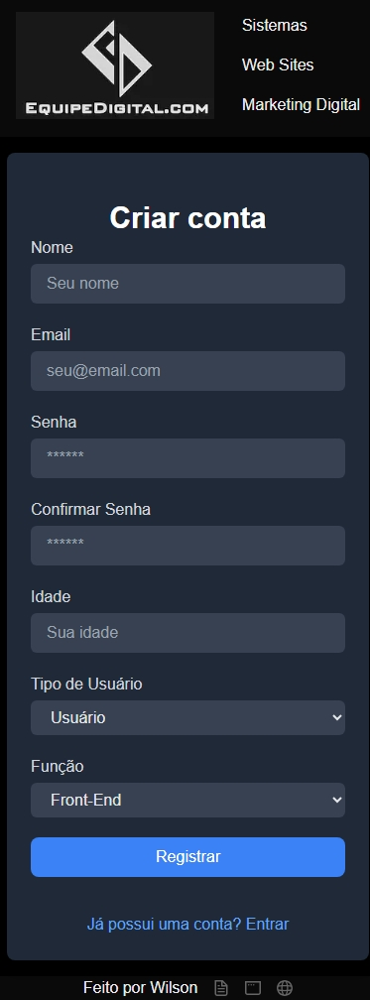
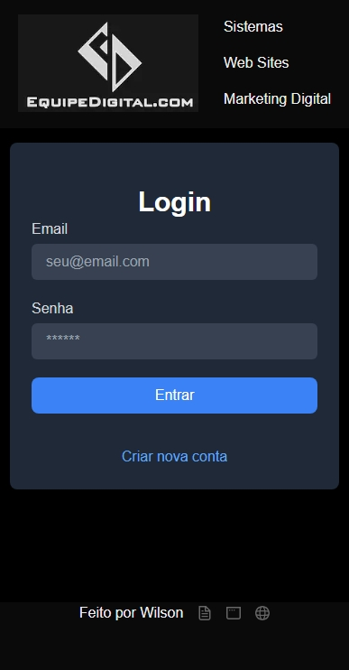
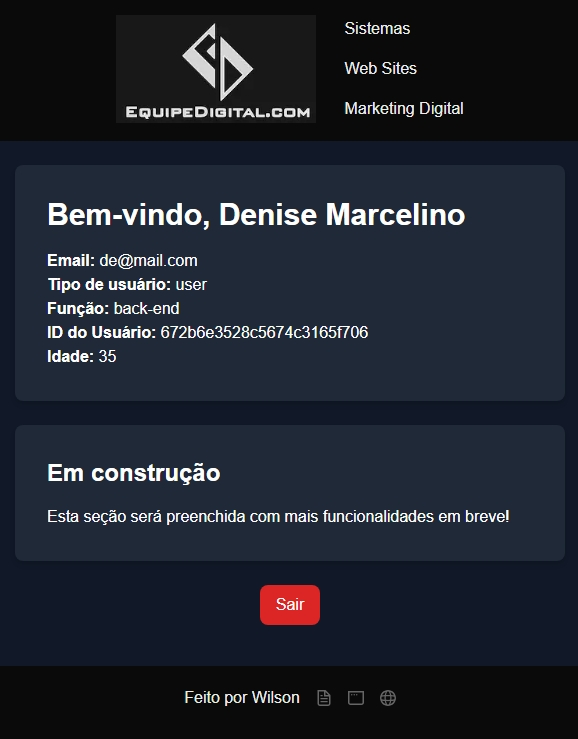
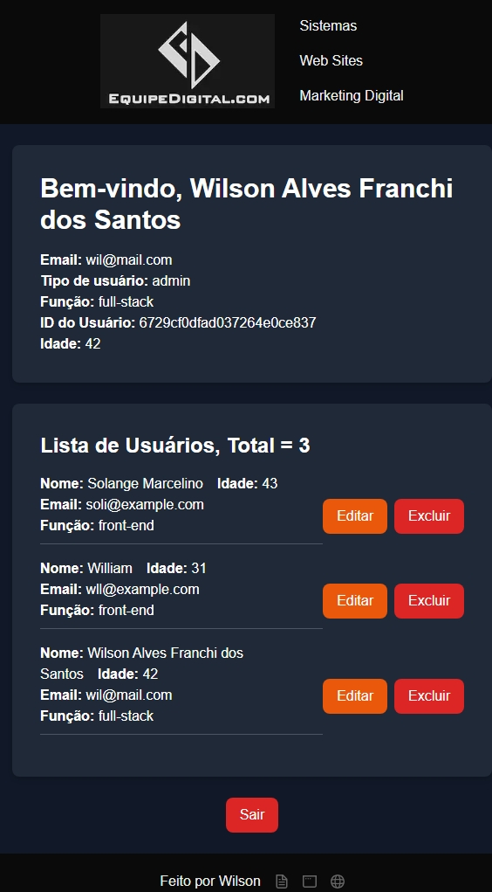

# Projeto de Autenticação e Gerenciamento de Usuários

Uma aplicação web robusta para autenticação e gerenciamento de usuários construída com Next.js, React, MongoDB e TypeScript. O projeto oferece uma interface intuitiva para login e registro, com validação de formulários avançada e suporte a rotas protegidas.

## ✨ Funcionalidades

- 🔐 Sistema completo de autenticação (login/registro)
- 📝 Validação de formulários com `react-hook-form` e `yup`
- 🗄️ Integração com MongoDB para persistência de dados
- 🛡️ Rotas protegidas para conteúdo autenticado
- 🎨 Interface responsiva e moderna
- 📱 Suporte completo a dispositivos móveis

## 🚀 Tecnologias Utilizadas

- Next.js
- React
- TypeScript
- MongoDB
- Mongoose
- react-hook-form
- yup
- Tailwind CSS

## 📋 Pré-requisitos

- Node.js (versão >= 14.x.x)
- Yarn ou npm
- Conta no MongoDB Atlas (ou MongoDB local)

## 🛠️ Instalação

1. Clone o repositório:

```bash
git clone https://github.com/seuusuario/seurepositorio.git
cd seurepositorio
```

2. Instale as dependências:

```bash
npm install
# ou
yarn install
```

3. Configure as variáveis de ambiente:
   - Crie um arquivo `.env` na raiz do projeto
   - Adicione sua URI do MongoDB:

```env
MONGODB_URI=mongodb+srv://<usuario>:<senha>@cluster0.mongodb.net/<seubanco>?retryWrites=true&w=majority
```

4. Inicie o servidor de desenvolvimento:

```bash
npm run dev
# ou
yarn dev
```

5. Acesse `http://localhost:3000` no seu navegador

## 📁 Estrutura do Projeto

```
.
├── fragments/       # Componentes reutilizáveis
├── schemas/        # Schemas de validação Yup
├── services/       # Configuração da API e MongoDB
├── types/         # Definições de tipos TypeScript
├── pages/         # Páginas do Next.js
└── components/    # Componentes React
```

## 💡 Como Usar

Faça o cadastro no sistema:  


Faça o login do usuário:  


Se for apenas user, recupera os dados:  


Se for admin, é possível excluir e editar os usuários:  


## 🔍 Notas Importantes

### Validação de Formulários

O projeto utiliza `react-hook-form` em conjunto com `yup` para validação de formulários. Os schemas de validação estão localizados na pasta `schemas/`.

## 📝 Licença

Este projeto está sob a licença MIT. Veja o arquivo [LICENSE](LICENSE) para mais detalhes.

## 📫 Contato

Link do Projeto: [https://github.com/Wilrrama/user_auth](https://github.com/Wilrrama/user_auth)
